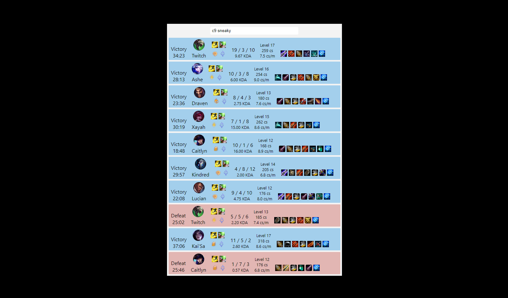

#League of legends stat tracker application

A React application built using the Riot API and a NodeJS Server (https://github.com/hubbabubbagump/lol-stats-server). Allows a user to search for a summoner through their name, and view the statistics of their last 10 matches.

The application is deployed at: https://priceless-bohr-fb5fe1.netlify.com/
